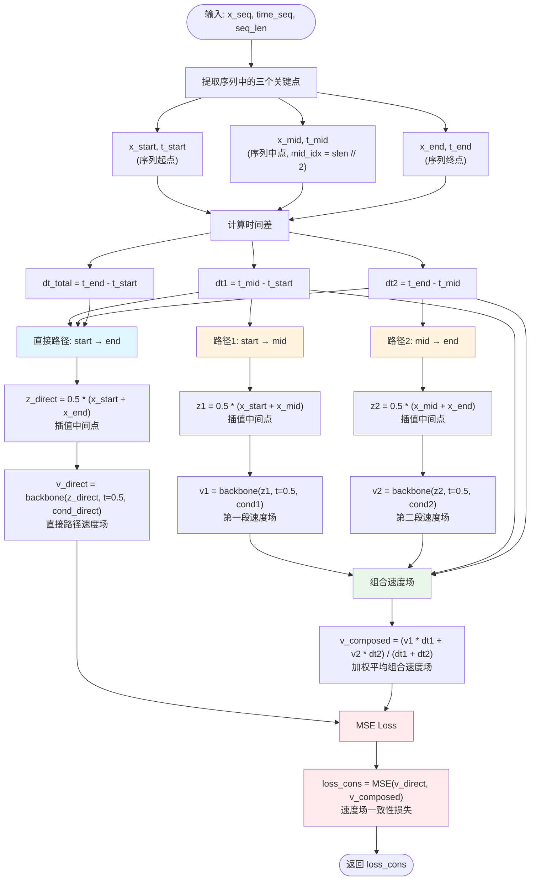

# Consistency Loss 实现流程图



## 核心思想

1. **速度场一致性约束**：直接跨越路径 (start → end) 的速度场预测应该与分步跨越路径 (start → mid → end) 的组合速度场一致

2. **关键步骤**：
   - 在每条路径的中间点（flow time t=0.5）查询速度场
   - 直接路径：`z_direct = 0.5 * (x_start + x_end)`，查询 `v_direct`
   - 分步路径：分别查询 `v1` (start→mid) 和 `v2` (mid→end)
   - 组合速度场：`v_composed = (v1 * dt1 + v2 * dt2) / (dt1 + dt2)`（按时间比例加权）

3. **优势**：
   - 避免多步采样，直接比较速度场
   - 有梯度，可高效训练
   - 每 N 步计算一次（`cons_every_n_steps`）以加速训练

4. **Loss 公式**：
   ```
   loss_cons = MSE(v_direct, v_composed)
   ```
