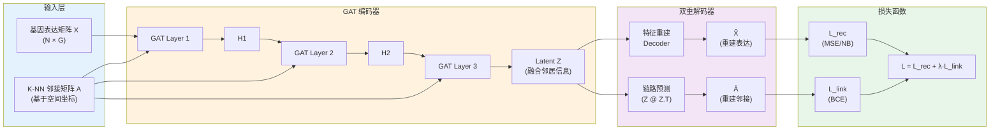
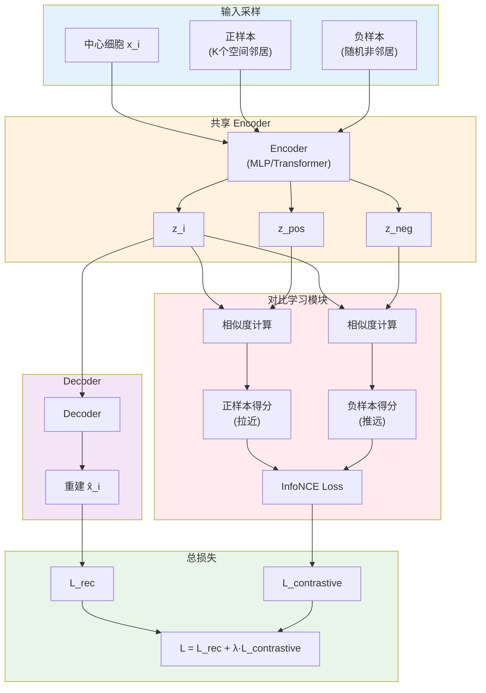
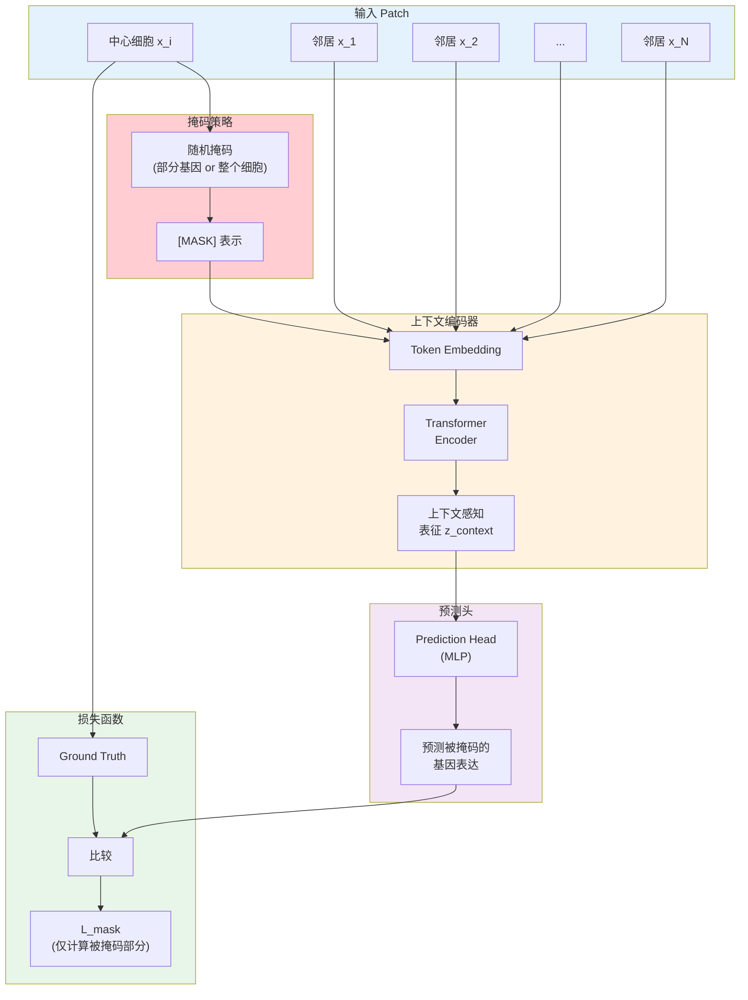

---

### 方案一：空间图自编码器 
通过图卷积（GCN）或图注意力（GAT）在编码阶段就强制引入微环境信息。
- **输入设计：** 将单细胞数据表示为一个图 $G = (V, E)$，其中 $V$ 是细胞节点的基因表达特征，$E$ 是根据物理坐标构建的 $K$-NN 邻接矩阵。
- **编码器 (Encoder)：**
    - 使用 2-3 层 **GAT (Graph Attention Network)**。
    - **关键点：** GAT 的注意力机制可以学习到哪些邻居对中心细胞的影响更大，从而更好地建模微环境。
- **双重解码器 (Dual Decoder)：**
    1. **特征重建层：** 重建中心细胞的基因表达向量 $\hat{X}$。
    2. **结构重建层（链路预测）：** 预测细胞间的连接概率 $\hat{A}$。这能强迫 Latent 空间保留x-space的拓扑结构

#### 架构图：Spatial Graph AE (One-Stage)

---

### 方案二：Contrastive AE
，强制 Latent 空间在局部邻域内保持平滑。
- **核心思想：** 协同优化重建损失和邻域对比损失。
- 损失函数设计：$$L = L_{rec} + \lambda L_{contrastive}$$
- **$L_{contrastive}$ 的实现：**
    - **正样本对：** x-space中的 $K$ 个邻居细胞。
    - **负样本对：** 随机采样的非邻居细胞。
    - 使用 **InfoNCE Loss**，强制中心细胞的 Latent 表示 $z_i$ 与其物理邻居 $z_j$ 的距离尽可能近。这会直接修正你之前图中红色点（z-space 邻居）和蓝色点（x-space 邻居）不统一的问题。

#### 架构图：Contrastive AE (One-Stage)

---

### 方案三：掩码自编码器 Context-Aware Masked AE
借鉴 **scGPT** /**MAE**/**cellBERT** 的思路，通过"预测缺失信息"来理解微环境。
- **设计逻辑：**
    1. 输入一个中心细胞和它周围的 $N$ 个邻居细胞作为一个输入 Patch。
    2. **掩码：** 随机遮盖中心细胞的部分高变基因，或者直接遮盖整个中心细胞的表达。
    3. **预测：** 让编码器利用邻居细胞的特征来预测（补全）中心细胞被遮盖的信息。
- **优点：** 这种方案能迫使模型学习到"微环境如何决定细胞状态"的条件概率，而不仅仅是简单的特征降维。

#### 架构图：Context-Aware Masked AE (One-Stage)

